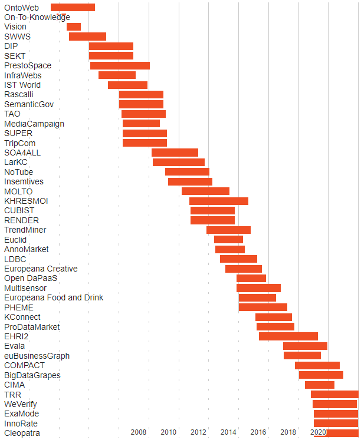

# Ontotext Framework Projects Timeline
## Research Projects Under the EU Framework Programmes 

https://rawgit2.com/VladimirAlexiev/onto-fp/master/index.html, also at https://www.ontotext.com/knowledge-hub/research-projects/

- It uses a [Google Sheet](https://docs.google.com/spreadsheets/d/1qRQbDVlRXrH4g8wcgZai65Zjn7D3N1mL-rIIzUoXmlk/edit) to hold the data, and Google Charts to visualize it.
- Hover over a project name to see its logo, dates and short description
- Click to go to the project website

Preview:

